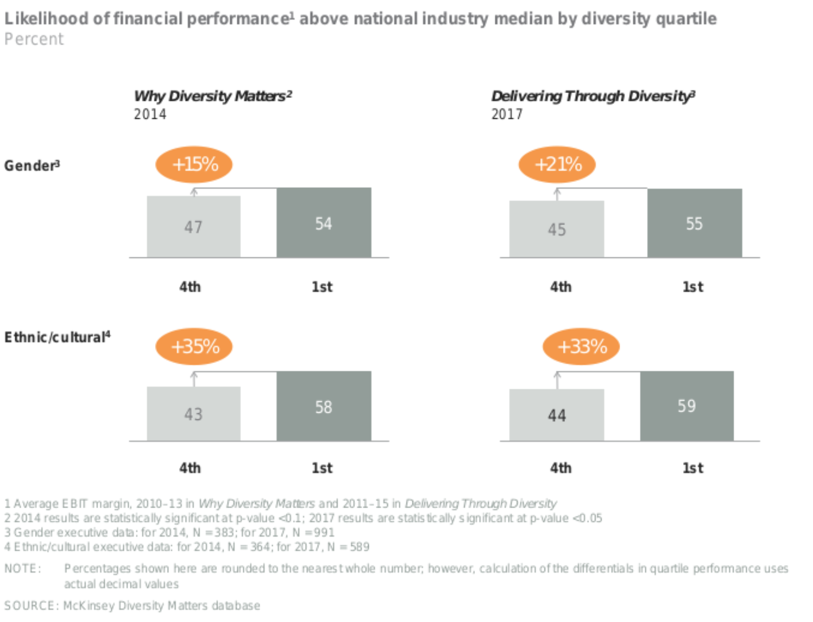
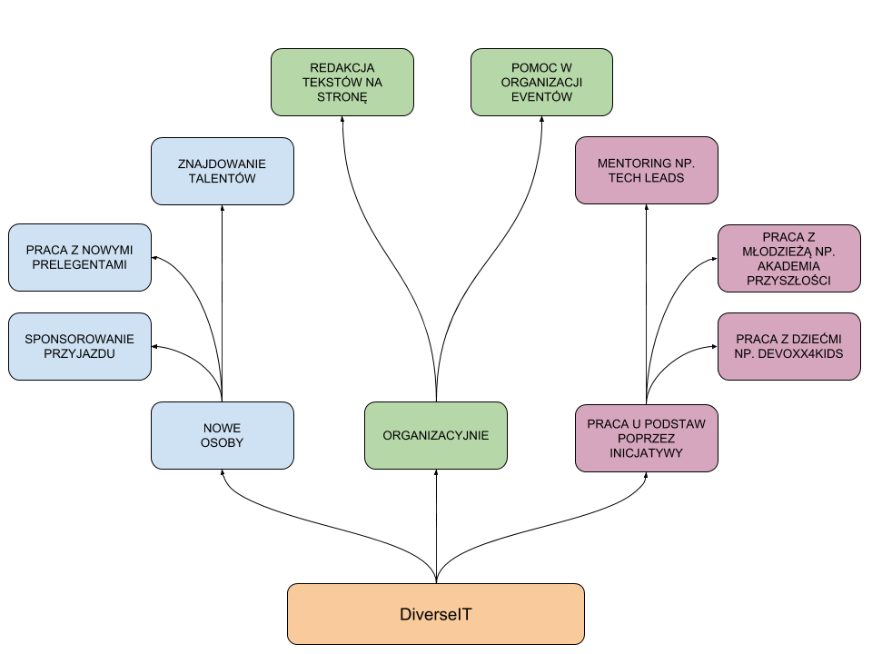

# Różnorodność w branży technologicznej nadal ma znaczenie w 2018 roku

_2019-02-11 Artykuł przetłumaczony na polski ze strony i za zgodą [Devskiller.com](https://devskiller.com/diversity-in-tech/). For the original, English version go to [Devskiller.com](https://devskiller.com/diversity-in-tech/)._

**Przedstawiamy Wam 14 powodów, dla których tak się dzieje**

Niektórzy w Dolinie Krzemowej twierdzą, że kwestia różnorodności nie stanowi już problemu. Mamy jednak rok 2018, a [statystyki dotyczące różnorodności](https://informationisbeautiful.net/visualizations/diversity-in-tech/) w branży technologicznej pokazują, że przemysł jest nadmiernie biały i zmaskulinizowany.

Twoje poglądy mogą nie być tak skrajne, jak te w [notce o różnorodności](https://gizmodo.com/exclusive-heres-the-full-10-page-anti-diversity-screed-1797564320) wysłanej do pracowników Google&#39;a. Nadal też może Ci się wydawać, że wszystko działa, jak powinno. Merytokracja oznacza, że najlepsi kandydaci otrzymują najlepsze stanowiska niezależnie od swojego pochodzenia. Czy to nie takie podejście przyczyniło się do powstania świetnych produktów, zespołów i firm?

Jednak dane nie wskazują na taki stan rzeczy. Różnorodność w branży technologicznej nadal ma znaczenie. Zwracanie uwagi na ten fakt może przynieść wiele korzyści. Ten artykuł wyjaśni, dlaczego:

1. Różnorodność w branży technologicznej nadal jest istotna
2. Dolina Krzemowa nie wierzy w powodzenie swoich inicjatyw
3. Różnorodność w branży technologicznej jest fałszywie przedstawiana i wymaga ulepszenia
4. Różnorodność przekłada się na lepsze wyniki finansowe
5. Kierowanie się ideą różnorodności pozwala znaleźć najlepszych kandydatów
6. Różnorodność w branży sprawia, że pracownicy bardziej się angażują
7. Zróżnicowane środowisko pracy pozwala zatrzymać najlepszych pracowników
8. Programiści najlepiej odnajdują się w zróżnicowanym środowisku
9. Zróżnicowane zespoły pracują lepiej
10. Zróżnicowane zespoły tworzą lepsze produkty
11. Różnorodność korzystnie wpływa na produktywność i proces innowacji
12. Różnorodność poprawia kreatywność zespołu
13. Różnorodność korzystanie wpływa na proces decyzyjny
14. Inwestorzy, ceniący różnorodność w dziedzinie technologii, zyskują dostęp do niewykorzystanych szans

**1. Różnorodność w branży technologicznej nadal jest istotna**

Atlassian, firma słynąca z tak wpływowych narzędzi jak Jira, w 2018 roku przeprowadziła ankietę dotyczącą stanu inkluzywności i różnorodności w branży technologicznej w Stanach Zjednoczonych [(State of Diversity and Inclusion in U.S. Tech)](https://www.atlassian.com/diversity/survey/2018). Z badania wyraźnie wynika, że dla ludzi z branży różnorodność nadal ma znaczenie.

Dla 80% ankietowanych inkluzywność i różnorodność są ważne dla przemysłu technologicznego.

Żródło: [State of Diversity and Inclusion in U.S. Tech](https://www.atlassian.com/diversity/survey/2018)

_Tłumaczenie grafiki:_

_80% respondentów zgadza się z twierdzeniem, że inkluzywność i różnorodność są ważne_

Różnorodność nie jest pojęciem abstrakcyjnym, pobieżnie wspieranym na poziomie szeroko rozumianego przemysłu.

- 77% ankietowanych twierdzi, że inkluzywność i różnorodność są ważne w ich firmach
- 85% uważa, że inkluzywność i różnorodność są ważne dla pracowników w ich firmach
- 71% jest zdania, że różnorodność i inkluzywność są ważne dla osób zajmujących kierownicze stanowiska w ich firmach

Ankieta Stack Overflow przeprowadzona wśród programistów okazuje się jeszcze bardziej szczegółowa. 85,7% managerów ds. produktu ceni sobie różnorodność w branży. Podobnego zdania są kierownicy ds. technicznych, kierownicy ds. zapewniania jakości oraz eksperci naukowi ds. obróbki danych.

Źródło: [Stack Overflow via Devskiller](https://devskiller.com/steps-hire-more-women-tech/)

Kto ceni różnorodność?

_Tłumaczenie grafiki:_

- _Manager ds. produktu 85,7%_
- _Kierownik ds. technicznych 79,3%_
- _Kierownik ds. zapewniania jakości 77,1%_
- _Ekspert naukowy ds. obróbki danych 76,7%_
- _Front-End Web Developer 76,6%_
- _Deweloper aplikacji mobilnych - IOS 76,4%_
- _Deweloper aplikacji mobilnych - Android 75,9%_
_42,156 odpowiedzi_

W branży technologicznej o wiele częściej wierzy się w różnorodność, niż wdraża konkretne działania z nią związane. Wciąż jednak z badania przeprowadzonego przez Atlassian wynika, że:

- 63% firm w Dolinie Krzemowej opiera się na inicjatywach zatrudniania przedstawicieli grup mniejszościowych
- 60% firm bazuje na różnorodności zespołu i inkluzywności

Jedno jest pewne. Niezależnie od stanowiska, różnorodności w tej branży nie można ignorować. Czy oznacza to, że przemysł technologiczny patrzy na nią przez różowe okulary? Okazuje się, że nie.

**2. Dolina Krzemowa nie wierzy w powodzenie swoich inicjatyw**

Tylko nieliczni respondenci badania przeprowadzonego przez Atlassian, zapytani o różnorodność w branży, przyznali Dolinie Krzemowej ocenę bardzo dobrą. Ankietowani pewni są jednak statusu quo bliższego ich własnym doświadczeniom. 34% z nich uważa, że inicjatywy dotyczące różnorodności zdają egzamin w ich firmach. 38% sądzi, że sprawdzają się one jedynie w głównych zespołach. Nadal jednak, niemal dwie trzecie ankietowanych nie wierzy w powodzenie tych działań.

Żródło: [State of Diversity and Inclusion in U.S. Tech](https://www.atlassian.com/diversity/survey/2018)

_Tłumaczenie grafiki:_

- _Dolina Krzemowa: Ankietowani, którzy przyznali ocenę bardzo dobrą_
- _Liczba ankietowanych (%)_
- _Cały przemysł technologiczny_
- _Twoja firma_
- _Główny zespół w Twojej firmie_

Nasuwa się pytanie, czy tego typu inicjatywy są w ogóle potrzebne. Ankieta sporządzona przez firmę Atlassian wykazuje, że według blisko połowy respondentów usprawnianie inicjatyw dotyczących różnorodności pod względem wieku (47%), płci (41%), rasy i narodowości (42%) czy orientacji seksualnej nie jest konieczne (53%).

Źródło: [State of Diversity and Inclusion in U.S. Tech](https://www.atlassian.com/diversity/survey/2018)

_Tłumaczenie grafiki:_

- _Dolina Krzemowa: Usprawnienia inicjatyw nie są konieczne_
- _Liczba respondentów (%)_
- _Wiek_
- _Płeć_
- _Rasa/narodowość_
- _Orientacja seksualna_

Przemysł uważa zatem, że wdrażane działania nie przynoszą rezultatów. Dlaczego?

**3. Różnorodność w branży technologicznej zostaje fałszywie przedstawiana i wymaga ulepszenia**

Różnorodność to złożony koncept, który wymaga wykorzystania wielu zasobów oraz dużej ilości energii. To z kolei może prowadzić do zjawiska, które Atlassian określa mianem zmęczenia różnorodności (ang. _diversity fatigue_). Znalezienie rozwiązań w kontekście różnorodności może okazać się problematyczne, zwłaszcza gdy postęp w branży jest zbyt mały lub wcale go nie widać. Mnogość kwestii, które należy poruszyć rozmawiając o różnorodności może okazać się zbyt przytłaczająca. To z kolei prowadzi do bezczynności i paraliżu.

Często też o różnorodności nie rozmawia się w sposób właściwy. Wiele programów Doliny Krzemowej dotyczących inkluzywności skupia się na zatrudnianiu osób, które wpisują się w pewien zróżnicowany profil. To może doprowadzić do zaistnienia tzw. tokenizmu. Tokenizmem określa się sytuację, w której firmy zatrudniają kandydatów tylko i wyłącznie ze względu na ich doświadczenie życiowe. Ignorowane zatem zostaje ich doświadczenie zawodowe. Badania pokazują, że może to negatywnie wpłynąć na samych kandydatów i spowodować spadek wydajności – pracownicy czują, że są w firmie tylko po to, by spełnić pewne normy dotyczące różnorodności.

Promowanie idei inkluzywności i różnorodności w wewnętrznych strukturach firmy zdaje się być naturalnym sposobem na przyciągnięcie zróżnicowanych kandydatów. Oznacza to skupienie się nie tylko na sposobie zatrudniania.

Pracownicy Doliny Krzemowej twierdzą, że przyjęcie kilku wykwalifikowanych kandydatów (w myśl idei różnorodności), którzy faktycznie wpłyną na losy firmy to lepszy wybór, niż fala zatrudnień na niskie stanowiska służąca wyłącznie osiągnięciu pewnego celu.

**4. Różnorodność przekłada się na lepsze wyniki finansowe**

Badanie [Why Diversity Matters](https://www.mckinsey.com/business-functions/organization/our-insights/why-diversity-matters), przeprowadzone przez McKinsey, wykazało, że firmy zatrudniające przedstawicieli grup mniejszościowych są bardziej wydajne. Świadczą o tym pewne obiektywne kryteria. Zgodnie ze sprawozdaniami finansowymi, wydajność firm zróżnicowanych pod kątem płci okazuje się być średnio o 15% lepsza. Z kolei firm zróżnicowanych etnicznie – o 35%.

Źródło: [Why Diversity Matters](https://www.mckinsey.com/business-functions/organization/our-insights/why-diversity-matters)

_Tłumaczenie grafiki:_

- _Jak różnorodność koreluje z lepszym wynikiem finansowym_
- _Prawdopodobieństwo wyniku finansowego powyżej mediany przemysłu krajowego, w podziale na kwartyle dotyczące różnorodności_
- _4ty kwartyl 1 kwartyl                4ty kwartyl 1 kwartyl_
- _Różnorodność płciowa                Różnorodność etniczna_

Źródło: [Why Diversity Matters](https://www.mckinsey.com/business-functions/organization/our-insights/why-diversity-matters)

_Tłumaczenie grafiki:_

- _Zależność pomiędzy różnorodnością etniczną i wydajnością w podziale na kwartyle_
- _Różnorodność etniczna w zespole wykonawczym_
- _Prawdopodobieństwo wydajności powyżej mediany_
- _Górny kwartyl                Dolny kwartyl_

Efekt, jaki niesie za sobą różnorodność, widziany jest także na poziomie zarządzania. Wydajność najbardziej zróżnicowanych etnicznie zespołów wykonawczych jest większa o 20% od zespołów homogenicznych.

Taki skutek widoczny jest, gdy w firmach pracuje więcej kobiet. Według [Credit Suisse](https://publications.credit-suisse.com/tasks/render/file/index.cfm?fileid=88EC32A9-83E8-EB92-9D5A40FF69E66808), firmy z kobietami w zarządach otrzymują o 4% większy zwrot z inwestycji. To więcej w porównaniu do tych firm, w zarządach których zasiadają sami mężczyźni.

Źródło: [Gender diversity and corporate performance](https://publications.credit-suisse.com/tasks/render/file/index.cfm?fileid=88EC32A9-83E8-EB92-9D5A40FF69E66808)

_Tłumaczenie grafiki:_

- _ROE (rentowność kapitału własnego): 0 vs. 1 lub więcej kobiet w zarządzie_
- _- 0 kobiet w zarządzie       - 1 lub więcej kobiet w zarządzie_

Prawda jest taka, że firmy technologiczne o zróżnicowanym zatrudnieniu i zespole wykonawczym uzyskują lepsze wyniki na rynku. Jest kilka powodów, dla których tak się dzieje.

**5. Kierowanie się ideą różnorodności pozwala znaleźć najlepszych kandydatów**

W chwili obecnej, gospodarka Stanów Zjednoczonych wzrasta w szybkim tempie, a bezrobocie jest na rekordowo niskim poziomie.

Żródło: [Bureau of Labor Statistics via Google](https://www.google.pl/search?rlz=1C1CHBF_enPL769PL769&amp;q=united+states+of+america+unemployment+rate&amp;stick=H4sIAAAAAAAAAOPgUeLUz9U3sEw2LzfQMsxOttLPyU9OLMnMz9MvLgHSxSWZyYk58UWp6UAhq9K81NyCnPzK3NS8kviixJLULkY7LoQBQuQYYMvFATLAvLg4mRL9hnnmhWToBwCXaCPWAQEAAA&amp;sa=X&amp;ved=2ahUKEwi07c2j-4reAhUQhaYKHffnAR8Qth8wAXoECAYQBg)

_Tłumaczenie grafiki:_

- _3,9% (kwiecień 2018)_
- _Kalifornia_
- _Zjednoczone Królestwo_
- _Stany Zjednoczone 3,9% (kwiecień 2018)_

Nadal jednak 40% firm mierzy się z brakiem umiejętności. Dlatego też najwięcej wakatów to stanowiska dla osób początkujących. By zdobyć najlepszych programistów, warto sięgać do niekonwencjonalnych metod. Nie można polegać wyłącznie na osobach z polecenia. Należy korzystać ze źródeł, których wcześniej nie brało się pod uwagę, jak np. stowarzyszenia grup mniejszościowych w branży.

Konkurencja poszukuje pracowników tam, gdzie wszyscy. Działając niestandardowo, zyskuje się dostęp do niewykorzystanego rynku pracy, co umożliwia nawiązanie kontaktu z najlepszymi ludźmi.

Wraz ze zróżnicowanymi pracownikami, przychodzi większe zaangażowanie.

**6. Różnorodność w branży sprawia, że pracownicy bardziej się angażują**

Kwestia zaangażowania to ogromny problem. [Badanie Gallupa](https://www.gallup.com/services/178517/state-global-workplace.aspx) wykazało, że tylko 13% pracowników aktywnie angażuje się w swoje obowiązki. Istnieje jednak [zachowanie regulacyjne](https://www.mckinsey.com/business-functions/organization/our-insights/why-diversity-matters), które ma na to wpływ. Jest nim aktywna postawa wobec różnorodności.

Dlaczego zaangażowanie jest tak ważne? Sprawia, że ludzie w firmie przywiązują się do tego, co robisz i czym się zajmujesz. Firmy o najlepszych poziomach zaangażowania odnotowują:

o 10% wyższe wskaźniki klientów
o 17% wyższą produktywność
o 20% wyższą sprzedaż
o 21% wyższą rentowność
o 41% mniejszą absencję
o 24% niższą rotację w organizacjach o wysokim wskaźniku rotacji pracowników
o 59% niższą rotację w organizacjach o niskim wskaźniku rotacji pracowników
o 28% mniejszy spadek produktywności
o 40% mniej problemów z jakością

Źródło: [State of the Global Workplace](https://www.gallup.com/workplace/238079/state-global-workplace-2017.aspx?utm_source=2013StateofGlobalWorkplaceReport&amp;utm_medium=2013SOGWReportLandingPage&amp;utm_campaign=2013StateofGlobalReport_Redirectto2017page&amp;utm_content=download2017now_textlink)

_Tłumaczenie grafiki:_

- _Firmy plasujące się w górnym kwartylu wskaźnika zaangażowania pracowników, w stosunku do tych z dolnego kwartyla odnotowały:_
- _o 10% wyższe wskaźniki klientów_
- _o 17% wyższą produktywność_
- _o 20% wyższą sprzedaż_
- _o 21% wyższą rentowność_
- _o 41% mniejszą absencję_
- _o 24% niższą rotację w organizacjach o wysokim wskaźniku rotacji pracowników_
- _o 59% niższą rotację w organizacjach o niskim wskaźniku rotacji pracowników_
- _o 28% mniejszy spadek produktywności_
- _o 40% mniej problemów z jakością_

Zaangażowanie może mieć duży wpływ na wyniki finansowe firmy. Różnorodność jest jednym z lepszych sposobów, by je poprawić.

**7. Zróżnicowane środowisko pozwala zatrzymać najlepszych pracowników**

Zaangażowanie może znacznie zmniejszyć rotację pracowników oraz poprawić ich retencję. Dotyczy to szczególnie osób, które nie wpisują się w profil większości. Według badania przeprowadzonego przez Atlassian, zaledwie niecałe 30% grup mniejszościowych w Dolinie Krzemowej ma poczucie przynależności, reprezentacji i odczuwa chęć zatrzymania ich w firmie.

Zaangażowanie jest dla pracowników bardzo istotne. Widać to szczególnie przy podejmowaniu decyzji o odejściu do nowej firmy. Jednym z najlepszych sposobów na zatrzymanie dobrego pracownika jest kierowanie się założeniami różnorodności. Działa to na zasadzie efektu domina, wpływając pozytywnie na zadowolenie pracowników.

**8. Programiści najlepiej odnajdują się w zróżnicowanym środowisku**

Satysfakcja pracowników przekłada się na ich zaangażowanie. Jednak nie da się jej łatwo zmierzyć. Zróżnicowane otoczenie oddziałuje na poziom zadowolenia. Dotyczy to zwłaszcza grup mniejszościowych.

Z badań przeprowadzonych przez McKinsey wynika, że ogromny wzrost zadowolenia ma miejsce wtedy, gdy pracownicy o takich samych kwalifikacjach stanowią ponad 15% siły roboczej. Oznacza to, że nie należy podejmować symbolicznego wysiłku, by pochwalić się kilkoma nietradycyjnymi pracownikami. Różnorodność powinna być ważnym czynnikiem na wszystkich poziomach organizacji. Przyczyni się to do zatrzymania najlepszych ludzi w firmie i sprawi, że będą zadowoleni z tego, co robią.

Różnorodność w technologii pomaga nie tylko pracownikom z grup mniejszościowych, ale usprawnia pracę wszystkich.

**9. Zróżnicowane zespoły pracują lepiej**

Źródło: [rawpixel on Unsplash](https://unsplash.com/search/photos/diverse-team?utm_source=unsplash&amp;utm_medium=referral&amp;utm_content=creditCopyText)

Rozwój oprogramowania to proces wymagający ścisłej współpracy. Decyzje rzadko podejmowane są samodzielnie. Cechą [dobrego programisty](https://devskiller.com/hire-10x-software-developer/) jest umiejętność pracy w zespole.

[Katherine Phillips z Columbia Business School](https://publications.credit-suisse.com/tasks/render/file/index.cfm?fileid=88EC32A9-83E8-EB92-9D5A40FF69E66808) odkryła, że studenci bardziej przykładają się do zajęć, gdy pracują w zróżnicowanym zespole. Dzieję się tak wtedy, gdy zdają sobie sprawę z jego złożoności. Bardziej prawdopodobne jest, że właśnie grupa zróżnicowana, nie homogeniczna, rozwiąże dany problem. W takim zespole, wszyscy, włącznie z tymi, którzy stanowią większość, pracują lepiej. A gdy tak się dzieje, powstaje lepszy produkt.

**10. Zróżnicowane zespoły tworzą lepsze produkty**

Zróżnicowane zespoły budują orientację na klientów. Często pochodzą oni z różnych stron świata i mają różne oczekiwania. Zespoły, które stanowią odbicie dla złożoności grupy klientów swojej firmy, wyróżniają się na tle innych. Poprzez płeć, narodowość, kulturę, orientację seksualną czy wiek. Są bardziej świadome, jakich zmian potrzeba, by ulepszyć produkt.

Ma to wielkie znaczenie w branży, ponieważ najlepsze produkty powstają w innowacyjnych firmach.

I to właśnie dlatego różnorodność może w tym pomóc.

**11. Różnorodność korzystnie wpływa na produktywność i proces innowacji**

Zróżnicowane zespoły, zwłaszcza w branży technologicznej, pracują lepiej. Badanie różnorodności płci wśród zespołów technicznych wykazało, że takie grupy sumienniej trzymają się harmonogramu projektu. Koszty jego utrzymania są niższe, a efektywność indywidualnych pracowników jest lepiej oceniana. W rezultacie wyższe są także i premie.

W zróżnicowanym zespole mniej znaczy więcej. Po części dzięki kreatywności.

**12. Różnorodność poprawia kreatywność zespołu**

W psychologii istnieje pewien błąd poznawczy zwany heurystyką płynności (ang. _fluency heuristic_). Polega na tym, że pomysły, co do których jesteśmy przekonani, wydają nam się bardziej prawdziwe, atrakcyjne lub po prostu lepsze. Inaczej jest z pomysłami, z którymi nie czujemy się tak pewnie. Popełnianie błędu poznawczego może wpłynąć na kreatywność zespołu. W rezultacie będzie skłaniał się ku znanym już rozwiązaniom, a nie poszukiwał nowych. Zróżnicowany zespół wnosi nowe pomysły.

Nowi pracownicy, popełniając błąd poznawczy, zaczną jednak otwierać się na inne schematy myślowe. Takie działanie korygujące przyniesie bardziej kreatywne rezultaty, które są niezwykle ważne w przypadku pracy dewelopera oprogramowania. W końcu to do niego należy wymyślanie najciekawszych sposobów na rozwiązywanie problemów.

Paul Block, CEO, producent słodzika Merisant, powiedział:

_Ludzie, którzy prowadzą odmienne tryby życia i pochodzą z różnych środowisk są bardziej wymagający wobec siebie nawzajem. Z różnorodnością przychodzi różnica zdań. To jest potrzebne. Bez tego nie ma szans na żadne głębsze analizy czy przełomy._

Większa kreatywność oznacza lepszy proces decyzyjny.

**13. Różnorodność korzystanie wpływa na proces decyzyjny**

Zróżnicowane zespoły cechuje większa kreatywność, innowacyjność i lepsza współpraca, co przekłada się na podejmowanie lepszych decyzji. Pewien [raport](https://www.ncwit.org/sites/default/files/resources/impactgenderdiversitytechbusinessperformance_print.pdf) wykazał, że większej liczbie kobiet w zespole zdominowanym przez mężczyzn, przypisuje się wyższą inteligencją zbiorową. Naukowcy definiują to jako zdolność grupy do wykonywania rozmaitych zadań. Takie zespoły częściej eksperymentują, są kreatywne i dzielą się wiedzą.

Tam, gdzie firmy wdrażają inicjatywę różnorodności na poziomie przywództwa, McKinsey dostrzega zjawisko zwane nabywaniem różnorodności. Osobiste doświadczenia lidera przełamują zaściankowy wizerunek firmy. To sprawia, że cała organizacja zaczyna skłaniać się w stronę inkluzywności, sprzyjając kulturze komunikacji. A co najważniejsze, tworzy środowisko, w którym ludzie mogą wyrażać swoje odmienne poglądy. Przypływ informacji wpływa na podejmowanie lepszych decyzji.

Zatem, gdy różnorodność jest ignorowana, firmy technologiczne tracą możliwości, nawet na najwyższych szczeblach.

**14.**  **Inwestorzy, ceniący różnorodność w dziedzinie technologii, zyskują dostęp do niewykorzystanych szans**

[Badanie](https://hbr.org/2017/05/we-recorded-vcs-conversations-and-analyzed-how-differently-they-talk-about-female-entrepreneurs) szwedzkiego inwestora kapitału wysokiego ryzyka wskazuje na ciekawy wniosek. Przeciętnie, przedsiębiorczynie otrzymywały jedynie jedną czwartą dofinansowania, o które się ubiegały.

Przedsiębiorcy natomiast otrzymywali ponad połowę tego, o co prosili. Inwestorzy wysokiego ryzyka chętniej wspierali zatem przedsięwzięcia mężczyzn. To błąd. Firmy, w których kobiety stanowią od [0 do 30%](https://tech.cornell.edu/news/tech-experts-share-the-importance-of-diversity-and-how-to-foster-inclusion/) przedstawicieli zarządu, odnotowują 15-procentowy wzrost przychodów netto.

To dzięki modelowi kapitału wysokiego ryzyka branża technologiczna jest silnie finansowana.

Ignorując uprzedzenia względem większości, nie może inwestować w najlepsze talenty. Inwestor, który akceptuje swoje uprzedzenia, odkrywa możliwości, do których inni nie mają dostępu.

**W 2018 roku różnorodność wciąż ma znaczenie w branży technologicznej**

Różnorodność, o której mowa, nie jest przejściowym trendem. To wciąż poważny problem, z którym Dolina Krzemowa musi się zmierzyć. Korzyści, które niesie za sobą przyjmowanie pracowników w myśl idei różnorodności są niezliczone. Od jakości produktu, przez ludzi, których można do siebie przyciągnąć, po pieniądze, które można zarobić. Nie ma żadnej recepty na wyjaśnienie tego złożonego procesu. Niezmiernie istotne jest jednak, aby wziąć pod uwagę różnorodność. To coś, co z pewnością się opłaci.

---
# Co trzech białych mężczyzn może zrobić w kwestii różnorodności

_2018-08-01_

__[źródło](http://www.tokkoro.com/3000087-black-and-white_people_three.html)__

Temat różnorodności, należy do tematów przy którym często w narracji posługujemy się emocjami. Emocje z natury przedstawiają poglądy czy pojedyncze opinie. Dzięki czemu przestrzeń w której przebywamy na co dzień, jest nie tylko urozmaicona ale również bardzo złożona. To dzięki różnorodności właśnie ludzie są skłonni, do rozmaitych wniosków. Przez co dyskusja przybiera różne oblicza, od stonowanej wymiany argumentów, poprzez burzliwą wymianę zdań, po ciszę. Czyli brak głosu w obawach przed niezrozumieniem. Aby pomóc w podtrzymaniu głosu i prowadzenia merytorycznej dyskusji chcemy podzielić się następującymi faktami w odniesieniu do dysproporcji płci w sektorze IT.

__[źródło](https://www.pexels.com/photo/group-hand-fist-bump-1068523/)__

## Różnorodność jest potrzebna

Istnieje statystycznie znacząca korelacja pomiędzy różnorodnym zespołem zarządczym, a ponad standardowymi wynikami finansowymi osiąganymi przez firmy”. Taka zależność trwa nieprzerwanie od kilku lat, i została opisana w raporcie McKinsey & Company - “Why Diversity Matters” z 2014 roku. W styczniu 2018 roku McKinsey & Company opublikowało kolejny raport: [“Delivering Through Diversity”][1], który dodaje kilka nowych obserwacji: firmy plasują się powyżej 25% organizacji zróżnicowanych pod względem płci osiągały lepsze wyniki finansowe, jak i tworzyły znacząco lepsze produkty.

Różnorodność nie powinna być postrzegana wyłącznie jako kwestia wizerunkowa, dbająca o dobry PR. Możemy opierać się na konkretnych badaniach, na danych, które jednoznacznie pokazują korzyści z budowania zróżnicowanych zespołów. Nie ma dwóch identycznych osób i każdy ma do zaoferowania  coś osobistego. Aby zrealizować zadane cele, potrzebujemy korzystać z różnych poglądów, doświadczeń, metod. Wyjść poza homogeniczny, jednolity zespół i czerpać wiedzę z więcej niż pojedynczego źródła.

## Po co? Przecież mi jest dobrze!

W tym momencie zaczynają podnosić się głosy: nieprawda, jest dobrze, nie wolno sztucznie promować różnorodności (m.in. kobiet) w jakikolwiek sposób, szczególnie finansowy. Przecież, szczególnie w IT, wszyscy mają tak samo.

A jednak nie.

Uniwersytet Stanfordu przeanalizował, ponad sto podsumowań rozmów okresowych, [(performance reviews)][2], z których wynika, że mężczyźni przeszło dwukrotnie częściej niż kobiety otrzymują informację zwrotną odnoszącą się do ich kompetencji. Z raportu wynika też, że osiągnięcia kobiet są równie często postrzegane jako “kolektywne osiągnięcia zespołu”, co powoduje rozmycie ich zasług.

__[źródło](https://www.pexels.com/photo/caution-danger-information-safety-258063/)__

Niestety, statystycznie kobiety zdecydowanie częściej otrzymują negatywną informację zwrotną, niż taką nastawioną na rozwój. W takim środowisku nie da się wzrastać, rozwijać i pracować wydajnie. Co jest ciekawe, firmy, brane pod uwagę w raporcie, same zwróciły się o udział w nim.

__[źródło](https://www.pexels.com/photo/business-dirty-door-security-241028/)__

Wiele organizacji ma świadomość, że informacja zwrotna jest często stronnicza (ang. biased). Tego rodzaju zachowania są często nieuświadomione, trudne do kontrolowania i jeszcze trudniejsze do wyeliminowania. Dlatego należy szukać sposobów, aby ludzie siebie wzajemnie wspierali oraz inspirowali. Jedną z takich metod może być przyjęcie transparentnego i spójnego systemu wartościowania pracowników.

Firmy same zaczynają szukać sposobów rozwiązania problemu wyrównania szans. Dla przykładu firma Pivotal, gdzie dokonuje się aktywnych starań aby wynagrodzenia pracownicze były [zależne od zakresu obowiązków][3]. Manager pracujący w Pivotal, zostaje wyposażony w narzędzia, dzięki którym może kształtować polityki wynagradzania, zatrudnienia czy motywowania, przez co aspekty rasowe, kulturowe są [automatycznie wykluczane][3]. Takie działanie zdobywa coraz większe uznanie, wśród społeczności IT.

## Co trzech białych mężczyzn może zrobić w kwestii różnorodności

Dochodzimy do sedna. Czy w środowisku zdominowanym przez mężczyzn (takim jak IT, ale pewnie możemy odnieść to do wielu innych branż np. z nadreprezentacją jednej z płci), sami mężczyźni mogą coś zdziałać w kierunku różnorodności? Sądzimy, że wiele.

__[źródło](https://www.pexels.com/photo/black-and-white-dark-decoration-faces-134402/)__

Przede wszystkim nie pozostawiać spraw samym sobie lecz na każdym kroku wykazywać się możliwie największą dozą empatii. Tylko dzięki temu możemy dojść do sedna problemu i tworzyć środowisko dostępne i przyjazne dla wszystkich. Nie poprzez odgórne nakazy (parytety) ale poprzez działania u podstaw i próby dojścia do sedna problemu.

## Dlaczego my?

Nasza inicjatywa ma na celu przyciągnąć ludzi o otwartych umysłach, z różnym wykształceniem, o różnej płci, orientacji seksualnej i przynależności etnicznej. Te różnorodności umożliwiają nam poznawanie problemów w szerszej perspektywie i przełamywanie standardowych sposobów myślenia.

Na nas, jako organizatorach spotkań, spoczywa dodatkowy obowiązek znalezienia oraz zaproszenia utalentowanych ludzi z całego świata, zachęcając ich do mobilności między różnymi lokalizacjami, zapewniając okazję do wymiany poglądów. Wynikiem tego jest środowisko, w którym ceni się i celebruje różnorodność.

Bogactwo punktów widzenia i szeroka wiedza specjalistyczna są podstawą naszego sukcesu. To właśnie różnorodność umożliwia nam sprostanie wielu złożonym wyzwaniom technologicznym, na które natrafiamy na co dzień. Pragniemy aby spotkania branży IT były miejscem, w którym różnorodność jest przewagą, dzięki której kreatywne dyskusje pozwalają wyłonić się nowym pomysłom.

__[źródło](https://www.pexels.com/photo/light-bulb-against-white-background-247753/)__

## Jak działamy?

Wyszukujemy konkretne osoby, żeby inspirowały kobiety i mężczyzn swoimi osiągnięciami i postawami

Do końca roku 2019, na spotkaniach w Warszawie i Trójmieście pojawi się co najmniej 9 nowych osób

- które po raz pierwszy dzielą się wiedzą
- które należą do grup niedoreprezentowanych

Nowym osobom staramy się pomóc (jeśli sobie tego życzą) w przygotowaniu tematu i prezentacji.

## Jak mogę się dołączyć?

Wiemy, że tak naprawdę problemy trzeba naprawiać na zupełnie innym poziomie. Należałoby rozmawiać z dziećmi i młodzieży o innym sposobie myślenia. Niestety, nie mamy mocy przerobowych żeby to zrobić. Na szczęście istnieją inne inicjatywy, które w tym zakresie funkcjonują, takie jak:
git@github.com:diverseitio/diverseitio.github.io.git
- [Devoxx4Kids](http://www.devoxx4kids.org/)
- [Szkoła 3.0](http://szkola30.pl/)
- [CodeKids](https://coderkids.pl/)
- [TechLeads](https://techleaders.eu/), [WomenInTechnology](https://www.womenintechnology.org/)
- [Akademia Przyszłości](https://akademiaprzyszlosci.org.pl/)

## Jak mogę się dołączyć?

Jeśli zainteresowała Cię nasza inicjatywa, poniżej pokazujemy jak możesz się dołączyć.

Praca z nowymi osobami:

- Znajdowanie talentów (rozmowa z ludźmi w Twojej pracy, Twoim otoczeniu o chęci szerzenia wiedzy)
- Praca z nowymi prelegentami (pomoc w przygotowaniu prezentacji, wyboru tematu prelekcji)
- Sponsorowanie przyjazdu osób z grup niedoreprezentowanych (opłacenie przylotu / przyjazdu i noclegu dla prelegentów / prelegentek)

Organizacyjnie:

- Redakcja tekstów na stronie (chcielibyśmy, żeby strona zawierała przydatne informacje o pozytywnym wpływie różnorodności)
- Pomoc w organizacji eventów (niestety, nie potrafimy się jeszcze fizycznie zeskalować - przydałaby się nam Twoja pomoc przy organizacji prelekcji)

Praca u podstaw poprzez inicjatywy

- Mentoring (mentoring nowych osób w IT jest kluczowy dla zwiększenia różnordności w IT. Jedną z inicjatyw, promujących mentoring jest [Tech Leads](https://techleaders.eu/).
- Praca z dziećmi i młodzieżą (Jednymi z inicjatyw, promujących pracę z dziećmi i młodzieżą są [Akademia Przyszłości](https://akademiaprzyszlosci.org.pl/) i  [Devoxx4Kids](http://www.devoxx4kids.org/))

## Co dalej?

[Napisz do nas](mailto:hi@diverseit.io) i działajmy dalej wspólnie!

Pomożemy Ci w wypracowaniu swojej pierwszej lub kolejnej prezentacji.

Zacznijmy razem pracować nad nową formuła spotkań, opartą o środowisko bezpieczne dla każdego uczestnika.

Autorzy:
[Marcin Grzejszczak](https://www.linkedin.com/in/marcin-grzejszczak-15565119/), [Damian Leszczyński](https://www.linkedin.com/in/dleszczynski/) i [Jakub Marchwicki](https://www.linkedin.com/in/kubamarchwicki/)

PS. [Nasze code of conduct](http://pl.communitycodeofconduct.com/)

[1]: https://www.mckinsey.com/~/media/mckinsey/business%20functions/organization/our%20insights/delivering%20through%20diversity/delivering-through-diversity_full-report.ashx
[2]: http://www.businessinsider.com/gendered-language-in-performance-reviews-2015-10?IR=T
[3]: https://content.pivotal.io/blog/pay-transparency-and-pay-equity-new-measures-and-progress
